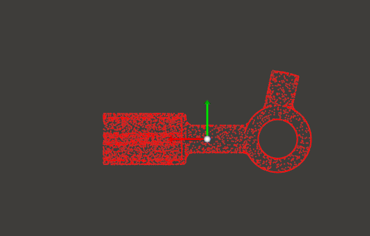
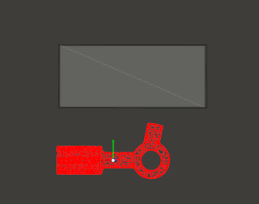
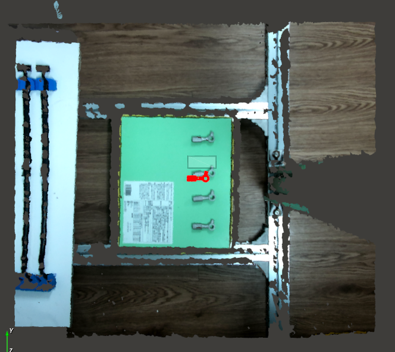
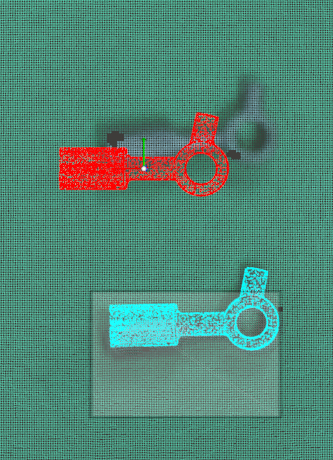

# train_data_template
 Test Camera 3D with RVS using Template Point Cloud

- Create point cloud from file 3D Object

- Create box auto mesh

- Import space image point cloud 3D 

- After add coordinates for the box

- Result

- Coordinate value

